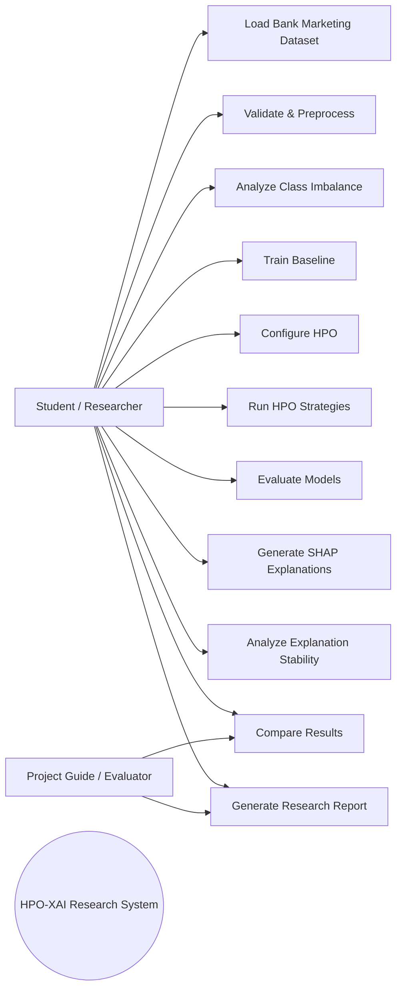
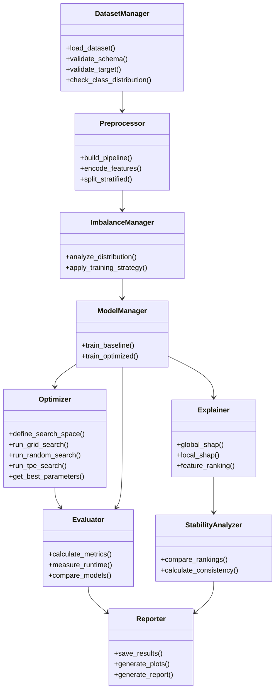
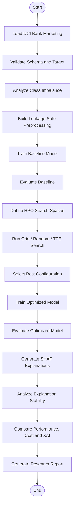
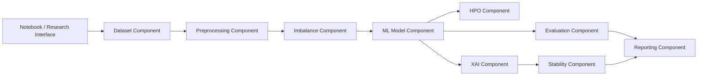
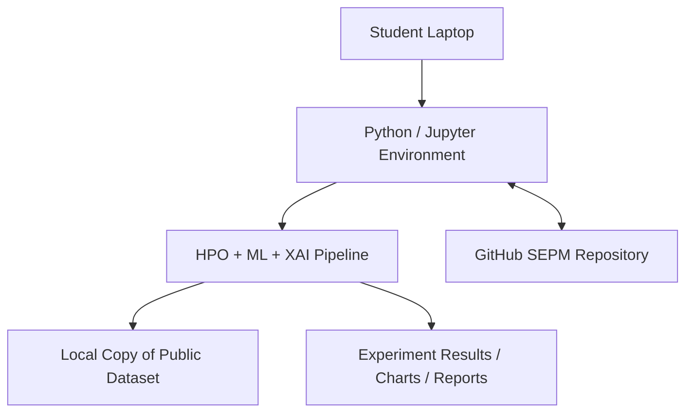

# UML Diagrams

## 1. Use Case Diagram



## 2. Class Diagram



## 3. Activity Diagram



## 4. Sequence Diagram

```mermaid
sequenceDiagram
    actor Researcher
    participant Data as Dataset Manager
    participant Prep as Preprocessor
    participant Model as Model Manager
    participant Opt as HPO Engine
    participant Eval as Evaluator
    participant XAI as SHAP Explainer
    participant Stab as Stability Analyzer
    participant Rep as Reporter
    Researcher->>Data: Load Bank Marketing
    Data->>Prep: Validated data
    Prep->>Model: Train/test-ready features
    Model->>Eval: Baseline predictions
    Eval-->>Researcher: Baseline metrics
    Researcher->>Opt: Start HPO strategies
    Opt->>Model: Candidate hyperparameters
    Model->>Eval: Candidate predictions
    Eval-->>Opt: Validation objective
    Opt-->>Model: Best configuration
    Model->>Eval: Optimized predictions
    Eval-->>Rep: Performance + runtime
    Model->>XAI: Model + evaluation samples
    XAI->>Stab: SHAP explanations
    Stab-->>Rep: Stability results
    Rep-->>Researcher: Comparative research report
```

## 5. Component Diagram



## 6. Deployment Diagram


