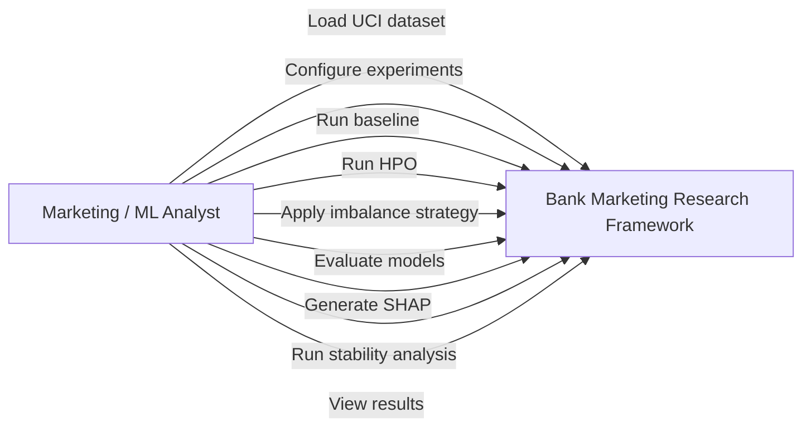
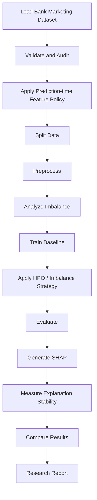
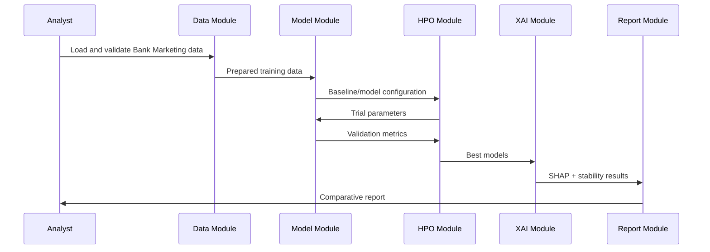

# UML Diagrams

## System
**Explainable Hyperparameter Optimization for Imbalanced Tabular Classification — Bank Marketing**

## 1. Use Case Diagram



## 2. Activity Diagram



## 3. Sequence Diagram



## 4. Model Scope

```text
Marketing / Banking Marketing Analytics
              ↓
       UCI Bank Marketing
              ↓
   ┌──────────┼──────────┐
   │          │          │
Random Forest XGBoost  CatBoost
   └──────────┼──────────┘
              ↓
       HPO + Imbalance
              ↓
          SHAP / XAI
              ↓
     Explanation Stability
```

## 5. Component View

```text
[Dataset Manager] → [Preprocessing] → [Imbalance Handler]
                                      ↓
[Experiment Config] → [Baseline/Model] → [HPO Engine]
                                      ↓
                              [Evaluation Engine]
                                      ↓
                                [SHAP Engine]
                                      ↓
                           [Stability Analyzer]
                                      ↓
                              [Report Generator]
```

## 5. Deployment View

```text
Student Workstation
 ├── Python/Jupyter
 ├── ML + HPO Libraries
 ├── UCI Bank Marketing Dataset
 ├── Experiment Logs
 └── GitHub Documentation
```
