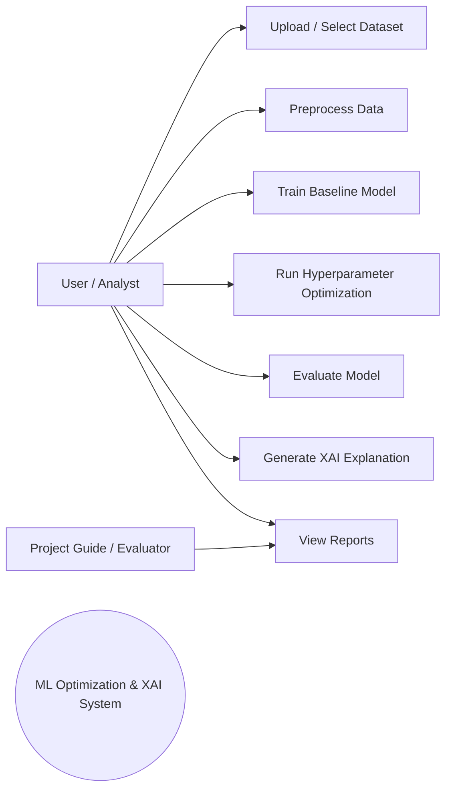
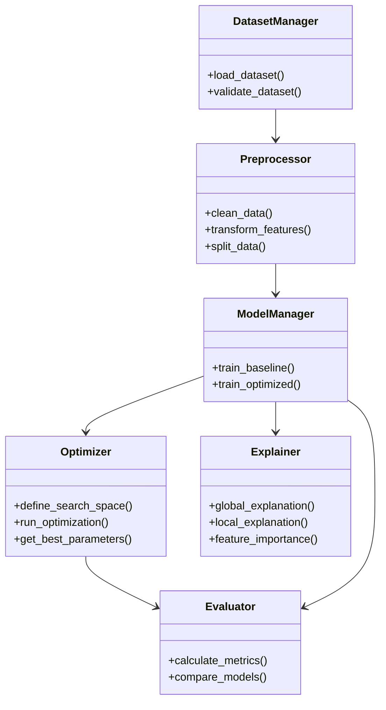
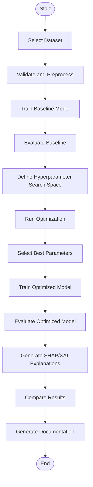
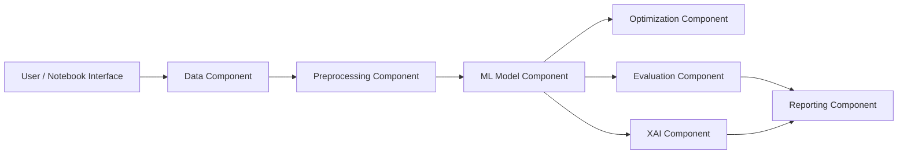
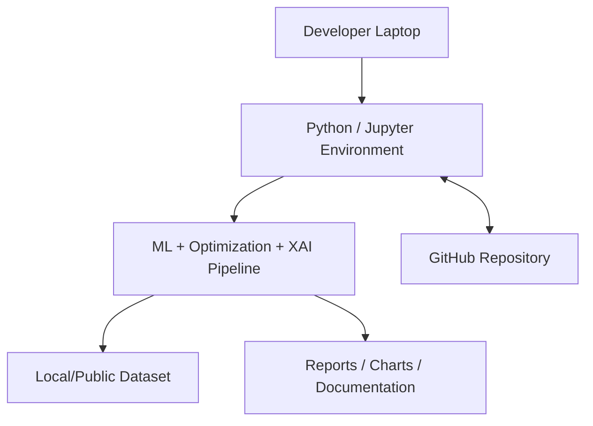

# UML Diagrams

## 1. Use Case Diagram



## 2. Class Diagram



## 3. Activity Diagram



## 4. Sequence Diagram

```mermaid
sequenceDiagram
    actor User
    participant Data as Dataset Manager
    participant Prep as Preprocessor
    participant Model as Model Manager
    participant Opt as Optimizer
    participant Eval as Evaluator
    participant XAI as Explainer
    User->>Data: Select dataset
    Data->>Prep: Send validated data
    Prep->>Model: Prepared train/test data
    Model->>Eval: Baseline predictions
    Eval-->>Model: Baseline metrics
    Model->>Opt: Request optimization
    Opt->>Model: Candidate parameters
    Model->>Eval: Candidate predictions
    Eval-->>Opt: Validation score
    Opt-->>Model: Best parameters
    Model->>Eval: Optimized predictions
    Eval-->>User: Final metrics
    Model->>XAI: Optimized model + data
    XAI-->>User: Feature and prediction explanations
```

## 5. Component Diagram



## 6. Deployment Diagram


